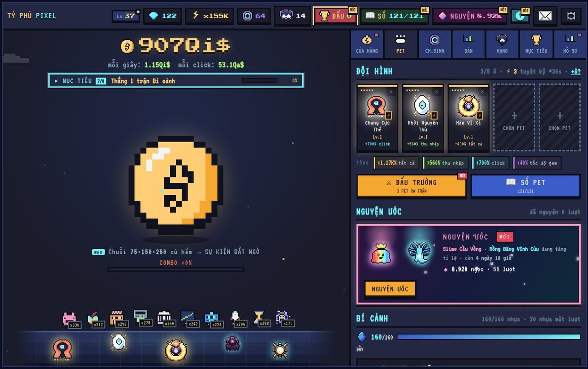
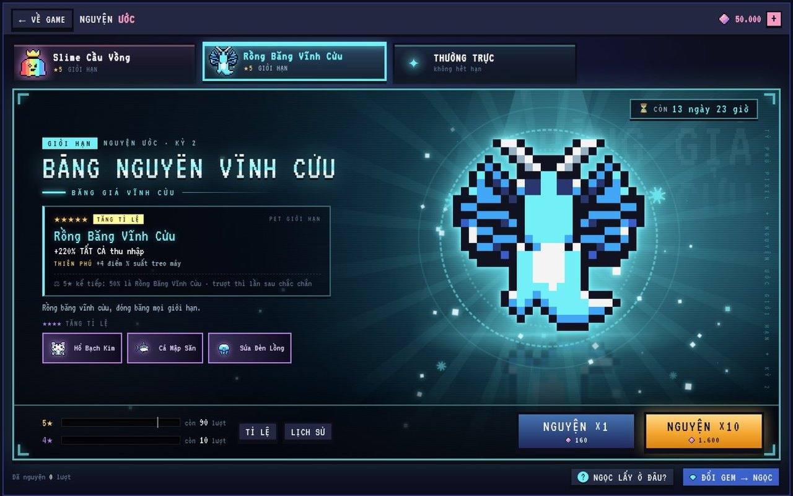
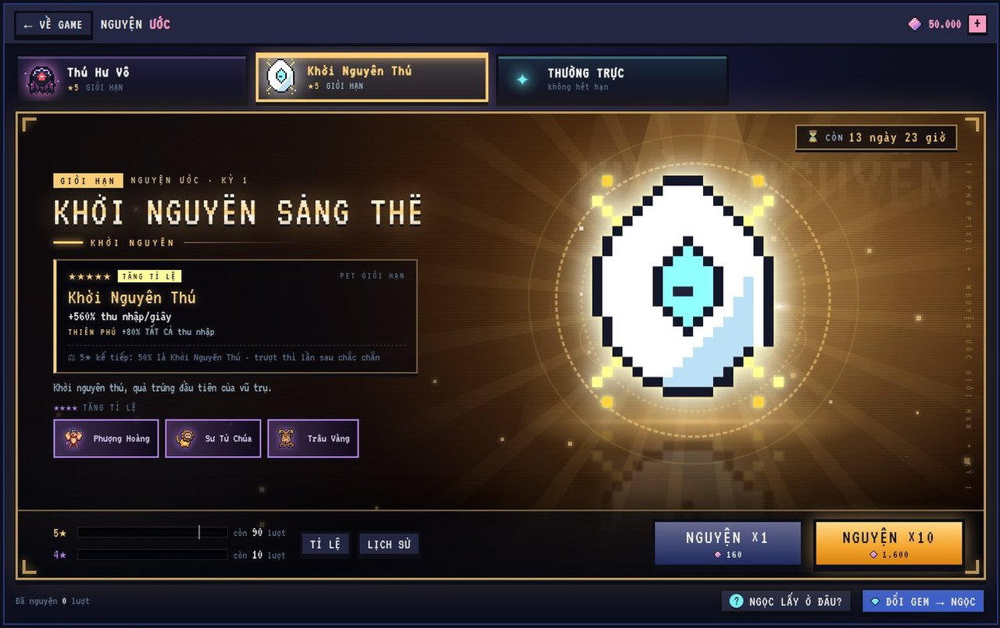
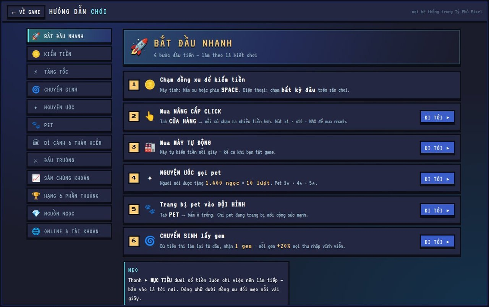
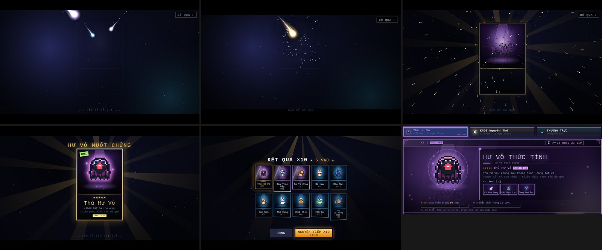
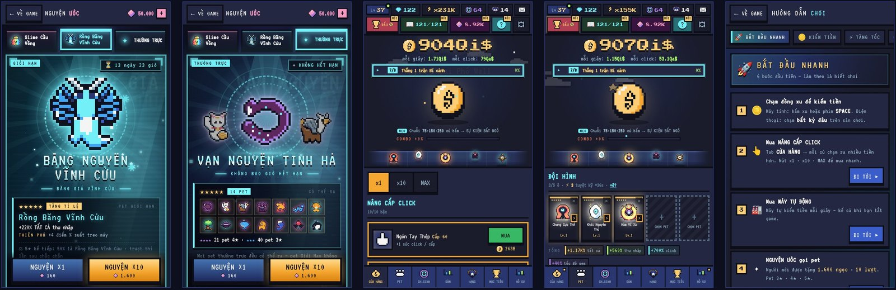
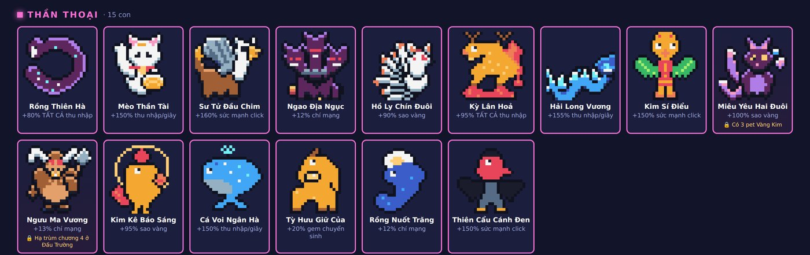

&nbsp;
&nbsp;
&nbsp;

### An 8-bit money clicker that got out of hand.

Tap the coin, build money printers, rebirth for gems, wish for pets, 
and climb a leaderboard that fights back against cheaters.

Free · plays in the browser on PC and phone · game UI in Vietnamese

## Screenshots

<table>
  <tr>
    <td width="50%"> <b>Main screen</b> · coin, machines, team, wishes and domains in one view</td>
    <td width="50%"> <b>Wish banners</b> · every limited 5★ pet gets its own stage and particles</td>
  </tr>
  <tr>
    <td width="50%"> <b>Rotating banners</b> · two limited banners every two weeks, plus a standard one</td>
    <td width="50%"> <b>In-game guide</b> · 12 chapters, numbers read straight from the game's constants</td>
  </tr>
</table>

<b>Summon cinematic</b> · canvas comets → impact → pixel-by-pixel card assembly → ×10 reveal grid

<b>Phone layout</b> · same file, its own layout under 820 px, installable as an app

<b>120 hand-pixelled pets</b> · the Mythic tier, one of eight

## What's inside

| | |
| :-- | :-- |
| 🪙 **Core loop** | Tap → upgrade clicks → buy machines that keep printing while you're away → rebirth for gems → ascend. Skill-tree perks, a stock market, daily check-ins and world events. |
| 🐾 **120 pets** | Eight rarity tiers, levels, gold & rainbow forging, evolutions, companion sets, expeditions and a pet codex. |
| ✨ **Wishes** | Two limited banners rotating every two weeks plus a standard banner, soft & hard pity with a 50/50 guarantee, and a cinematic summon with effects unique to each limited pet. |
| ⚔️ **Domains & Arena** | Resin-gated auto-battle domains (3 domains × 4 floors), an arena with boss chapters, renown, ranks and titles. |
| 💬 **Social** | Guest accounts, cloud save, friends, public profiles with namecards and badges, a mailbox with gifts, and a moderated world chat. |
| 🛡️ **Fair leaderboard** | Every cloud save passes a server-side Edge Function that checks it against what is actually possible in the game; flagged players drop off the board. |
| 📱 **Anywhere** | PC and phone layouts in one file, installable PWA, keeps playing offline or when the server is down — progress stays on the device. |
| 🔊 **8-bit sound** | Chiptune sound effects generated live with WebAudio. |

## How it's built

- **No framework, no engine.** Vanilla JavaScript, HTML5 Canvas and CSS in one self-contained file, minified with terser for production.
- **Server is the referee.** The Edge Function mirrors the game's balance constants (synced by a script on every balance patch), so its plausibility limits move with the game.
- **Safe deploy order.** Database → Edge Function → client, every time, so honest players are never flagged by a server that is behind the client.
- **Offline-first.** A service worker caches the shell; the save lives on the device and cloud sync is optional.
- **Tested before shipping.** Each release runs through a Playwright harness: gameplay flows on several save presets, phone layout checks, gacha rules, save integrity, XSS and offline mode.

**Stack:** JavaScript · HTML5 Canvas · CSS · WebAudio · Service Worker / PWA · Supabase (Auth, Postgres, RLS, RPC, Edge Functions in TypeScript) · Netlify · terser · Playwright

## Release highlights

| Version | When | What landed |
| :-- | :-- | :-- |
| **v13** | Oct 2026 | UI overhaul: key-art wish banners, a new team panel, an 8-step new-player journey and a full in-game guide |
| **v12** | Sep 2026 | Wishes: rotating banners, pity, resin and domains · v12.3–12.4 cinematic summons with per-pet effects |
| **v11** | Sep 2026 | Pets 2.0 / 3.0 (120 pets, forge, evolution, expeditions, public profiles), Arena 2.0, mailbox and world chat |
| **v5** | Aug 2026 | Gem economy, phone layout, installable PWA |

## About this repo

This is the project's showcase: screenshots, features, architecture and release notes. 
The game itself lives at **[typhupixel.com](https://typhupixel.com)** — the source and the server code stay private, because an anti-cheat only works while its rules aren't public.

  Designed, built and run by <a href="https://github.com/PmSubin">PmSubin</a> · © 2026 PmSubin. All rights reserved.

